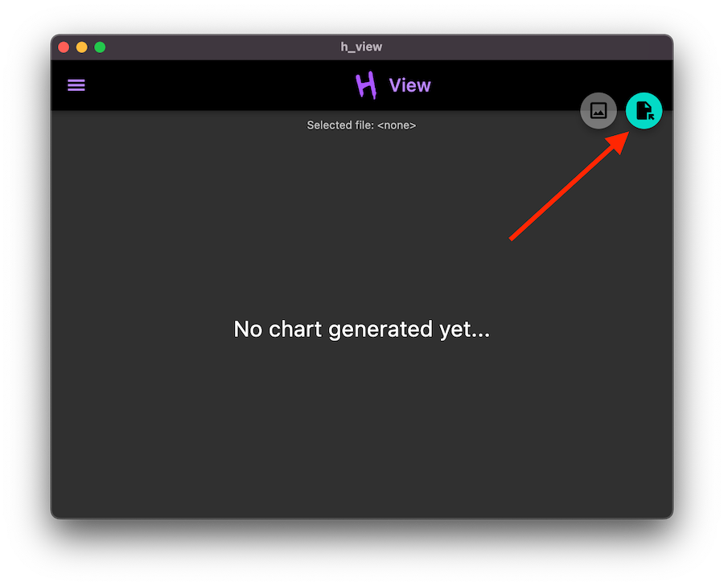

# HView


A Histogram Viewer for [HdrHistogram](http://hdrhistogram.org/), such as those produced by the
[wrk2](https://github.com/giltene/wrk2) performance testing tool.

HView can run in most browsers, as an offline web application ([PWA](https://web.dev/progressive-web-apps/)),
and as a desktop/mobile application on any OS supported by
[Flutter](https://flutter.dev/).

> You can try the web version at [hview.netlify.app](https://hview.netlify.app/).
> If you like Hview, you can install it by clicking on the install icon on the URL bar
> (on browsers that support it, like Chrome).

Currently, to use the native desktop/mobile application, you must build it yourself.

## Using HView

HView expects a file containing HdrHistogram data as input. Click on the top-right button to open a file picker.



Select the histogram file. If all goes well, you should see a chart like this:


Click on the top-left corner burger icon to open the settings drawer:


To export a PNG image with the chart, click on the button to the left of the file picker button:


## Creating wrk2 histograms

When using `wrk2`, make sure to run it with the `--latency` flag.

To provide a name for each series, include a single line with the title (starting with `# `) before each histogram data.

Example:

```
# My first series

< histogram data goes here>

# Another series

< histogram data goes here>
```

You may use a command as shown below to produce an appropriate file:

```shell
# Run Go Server (or whatever you're measuring) in another shell
echo "# Go HTTP\n" >> dart_vs_go.txt && \
wrk2 -t8 -c100 -d30s -R200 --latency "http://[::1]:8080/" >> dart_vs_go.txt

# Run Dart Server (or whatever else you're measuring) in another shell
echo "# Dart HttpServer\n" >> dart_vs_go.txt && \
wrk2 -t8 -c100 -d30s -R200 --latency "http://[::1]:8080/" >> dart_vs_go.txt
```

## Acknowledgements

HView is built on [Flutter](https://flutter.dev/).

Flutter charts are provided by [Syncfusion](https://help.syncfusion.com/flutter/cartesian-charts/).

The [HdrHistogram](http://hdrhistogram.org/) format and [wrk2](https://github.com/giltene/wrk2), which HView was
designed
to integrate with, were created by Gil Tene.

Thanks to [favicon.io](https://favicon.io/favicon-generator/) for providing a free, simple icon generator.
HView's icons were generated using it.

Thanks also to [Netlify](https://www.netlify.com/) for providing free hosting for the web app.

## Deploying HView Website

Run this command to build it:

```shell
flutter build web --release
```

Upload the `build/web` directory to a web server.

HView is currently deployed on [Netlify](https://www.netlify.com/) at
[hview.netlify.app](https://hview.netlify.app/).
